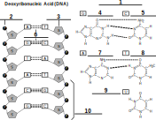

Albert-Ludwigs-Universität Freiburg

Lehrstuhl für Bioinformatik - Institut für Informatik - *http://www.bioinf.uni-freiburg.de*

Course ILIAS web page: *https://ilias.uni-freiburg.de/ilias.php?ref_id=2339316&cmdClass=ilobjcoursegui&cmd=view&cmdNode=zf:ns&baseClass=ilRepositoryGUI*

---
## Bioinformatics 1
###### WS 2021/2022
##### Exercise sheet 1: Biology basics - DNA/RNA
---
### _Exercise 1 - general_

**a)** Where is the genome stored in prokaryotes and eukaryotes?

- [ ] Inside the nucleus in eukaryotes

- [ ] Outside the cell in prokaryotes

- [ ] Prokaryotes have no genome

- [ ] Inside the nucleolus in prokaryotes

- [ ] In chromatin in eukaryotes

- [ ] Partially in mitochondria in prokaryotes

- [ ] Inside the nucleoid in eukaryotes

**b)** Name two more differences between prokaryotes and eukaryotes?

- [ ] Prokaryotes have compartmentation through membrane

- [ ] Eukaryotes are not multi-cellular organisms

- [ ] Prokaryotes have mitochondria

- [ ] Eukaryotes have no nucleus

- [ ] Prokaryotes have no ER

- [ ] Eukaryotes are single cell organisms

- [ ] Eukaryotes have no flagellum


**c)** Name examples for an organism for prokaryotes and eukaryotes.

- [ ] Escherichia coli is a prokaryote

- [ ] Amoebas are prokaryotes

- [ ] Fungi are eukaryotes

- [ ] Archaea are eukaryotes

- [ ] Insects are eukaryotes

- [ ] Salmonella is a prokaryote

- [ ] Plasmodium malariae is a prokaryote


**d)** What are the three information-carrying biopolymers?

- [ ] Protein

- [ ] Cellulose

- [ ] DNA

- [ ] Polysaccharides

- [ ] RNA

- [ ] amino acid

- [ ] nucleotide


**e)** What is denoted by the “Central Dogma” of molecular biology?

- [ ] Protein can make Protein

- [ ] DNA can make DNA

- [ ] Protein can make RNA and then RNA makes DNA

- [ ] DNA can make RNA and then RNA makes Protein

- [ ] RNA can make RNA

- [ ] DNA can make RNA and then RNA makes DNA

- [ ] Protein can make DNA


### _Exercise 2 - DNA and RNA_
The genetic information of an organism is stored in the DNA in the form of a code. This code consists of four building blocks or bases (A for adenine, C for cytosine, G for guanine, T for thymine). These bases or nucleotides follow each other in a certain sequence, e.g.:
```
AGTCGTAATTGGCCCCAATTGCAAAAA
```

A single hereditary unit consists of a subsequence of DNA (called a gene), which contains the information to build a functional RNA or protein molecule.

**a)** Match these terms to the correct number in the figure below: adenine, thymine, cytosine, guanine, uracil, phosphate, deoxyribose, hydrogen bond, backbone, and bases.



**b)** A piece of DNA contains 33% guanine. What are the percentages of adenine, cytosine, and thymine in that piece of DNA?

**c)** Decide which bases are pyrimidines and which are purines: A for adenine, C for cytosine, G for guanine, T for thymine, U for uracil.

**d)** Which of these statements concerning DNA and RNA are correct?

- [ ] Uracil is a standard base in RNA
- [ ] DNA is longer than RNA
- [ ] DNA and RNA have a different structure
- [ ] RNA has an intermolecular double-helix structure
- [ ] RNA contains ribose sugar

**e)** In what direction is an RNA sequence written?
- [ ] 3' end to 5' end
- [ ] 5' end to 3' end

**f)** Why is the RNA sequence written in that direction?
- [ ] The order is based on the numbering of the carbons in the sugar of the nucleic acid
- [ ] The order is based on the numbering of the carbons in the phosphate of the nucleic acid
- [ ] The order was arbitrarily chosen by the discoverer of RNA

**g)** Decide for the following RNAs whether they are coding or non-coding: mRNA, tRNA, rRNA, microRNA, siRNA, snoRNA


### _Exercise 3 - DNA and RNA_
**a)** What do these acronyms stand for within this course?

- DNA
- RNA
- ncRNA
- mRNA
- UTR
- ORF
- CDS

If you are puzzled, try to pick the right answer from the list below.
- non-coding-RNA
- Opposite-Reading-Frame
- Deoxyribonucleic acid
- non-complementary-RNA
- missense-RNA
- messenger-RNA
- ribonucleic acid
- untranslated region
- coding-strand
- coding-sequence
- open reading frame


**b)** Check whether the following terms belong to Eukaryotes, Prokaryotes, both.

- DNA
- [ ] Eukaryotes
- [ ] Prokaryotes
- splicing
- [ ] Eukaryotes
- [ ] Prokaryotes
- transcription
- [ ] Eukaryotes
- [ ] Prokaryotes
- ncRNA"
- [ ] Eukaryotes
- [ ] Prokaryotes
- single-cell-organism
- [ ] Eukaryotes
- [ ] Prokaryotes


**c)** Check whether the  following statements are True or False.

- [ ] The genome is stored in the nucleus


- [ ] FASTA files are used to store sequence information


- [ ] A Watson-Crick base pair describes a pyrimidine pairing with a purine


- [ ] A Watson-Crick base pair describes a purine pairing with a purine


- [ ] RNA is a single stranded bio-polymer


### _Exercise 4 - Programming assignment: Transcription and Translation_
**a)** Implement a function which takes a DNA sequence as an input and returns the corresponding RNA sequence.

Assume that the provided DNA sequence will be an uppercase string containing only the correct characters (from the domain "AGCT").
The function output RNA sequence also has to be in the upper case.

**b)** Implement a function which takes an mRNA sequence and produces the corresponding protein sequence.

Assume that the provided RNA sequence will be an uppercase string containing only the correct characters (from the domain "AGCU").
Assume that the sequence starts with the start codon (AUG) and ends with one of the end codons. It does not have any end codons in the middle.The number of characters in the input RNA sequence is a multiple of three.

The function output sequence also has to be in the upper case protein sequence.
To make it easier for you, we provided you with the translation table which is represented as a python dictionary. 
You can translate a single codon by simply using it:

```
translation_table["AUG"]

```
**c)** Combine the functions you implemented for the tasks **a)** and **b)** and obtain the central dogma function which gives you the protein sequence with a given DNA.

All the assumptions about the inputs and output are similar to the tasks **a)** and **b)**.

